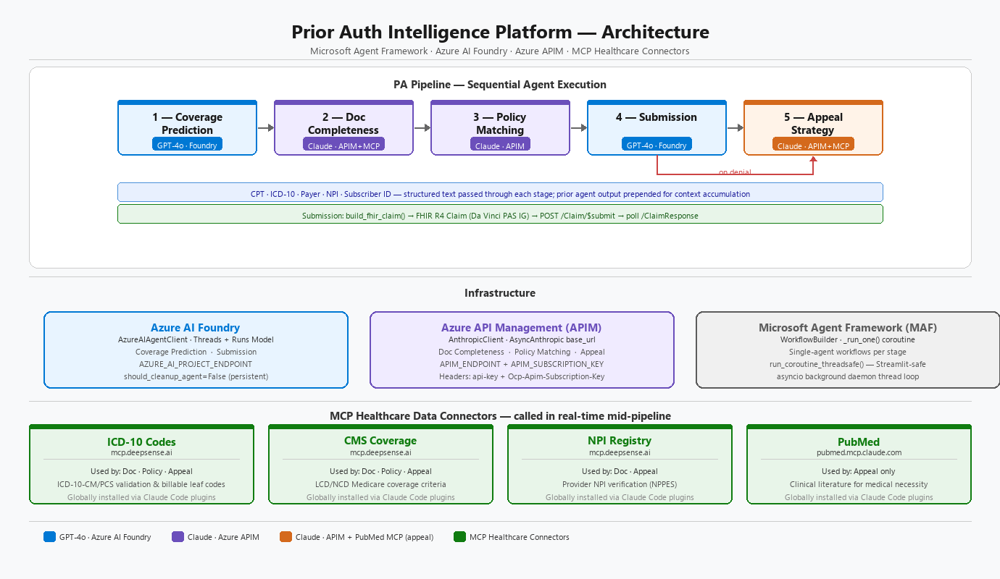
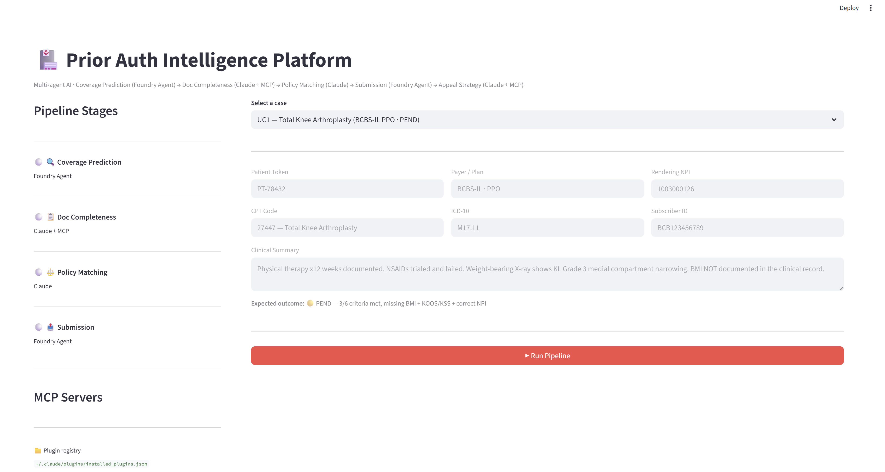
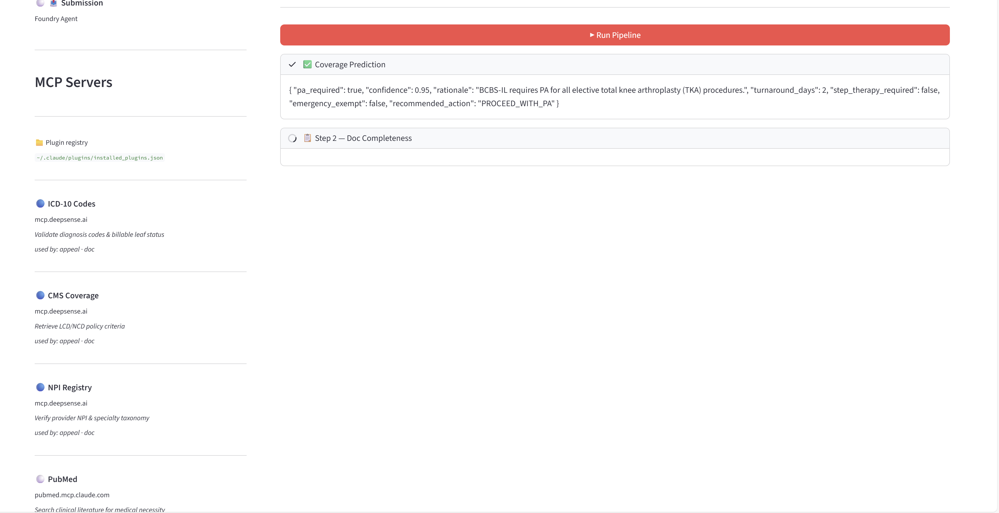
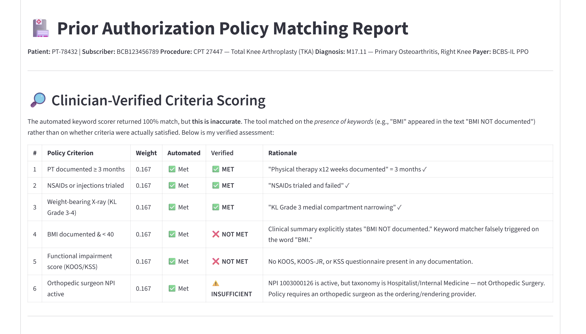

# Prior Authorization Intelligence Platform

The Prior Authorization Intelligence Platform is a multi-agent AI system designed to automate the healthcare prior authorization (PA) workflow — from coverage prediction to appeal strategy.

Instead of relying on a single LLM workflow, the system uses specialized AI agents, each responsible for a distinct operational step in the PA lifecycle:

Coverage Prediction Agent – Estimates likelihood of approval

Documentation Completeness Agent – Detects missing clinical artifacts

Policy Matching Agent – Aligns case details with payer policies

Submission Agent – Structures and packages the PA request

Appeal Strategy Agent – Generates intelligent appeal narratives

---

## Primary Users

| User | How They Use It |
|---|---|
| **Healthcare Providers & RCM Teams** | Authorization specialists pre-check coverage likelihood, detect documentation gaps, and reduce denial rates before submission |
| **Health Insurance Payers** | Utilization management and appeals teams automate medical necessity review, policy validation, and appeal generation to reduce manual workload and improve consistency |
| **HealthTech Platforms** | SaaS and digital health companies embed it to offer AI-driven prior authorization automation as part of their workflow solutions |
| **Enterprise AI & Innovation Teams** | Use it as a blueprint for deploying compliant, multi-agent AI systems in regulated healthcare environments |

---

## Architecture

### Agent Pipeline

| # | Agent | Model | Responsibility |
|---|---|---|---|
| 1 | **Coverage Prediction** | GPT-4o (Azure AI Foundry) | Determines if PA is required for a CPT + ICD-10 + payer combination |
| 2 | **Doc Completeness** | Claude Opus 4.6 (via APIM) | Reviews clinical notes against payer criteria; flags missing documentation |
| 3 | **Policy Matching** | Claude Opus 4.6 (via APIM) | Scores the case against payer LCD/NCD policy; predicts approval probability |
| 4 | **Submission** | GPT-4o (Azure AI Foundry) | Assembles FHIR Claim (PAS IG), submits to payer endpoint, polls for decision |
| 5 | **Appeal Strategy** | Claude Opus 4.6 (via APIM) | Analyzes denial codes, drafts appeal letters, recommends peer-to-peer review |



### MCP Healthcare Data Connectors

| MCP Server | Used By | Purpose |
|---|---|---|
| `icd10_codes` | Doc, Policy, Appeal | ICD-10-CM/PCS code validation |
| `cms_coverage` | Doc, Policy, Appeal | Medicare LCD/NCD policy criteria |
| `npi_registry` | Doc, Appeal | Provider NPI verification (NPPES) |
| `pubmed` | Appeal | Clinical literature for medical necessity |

---

## Technology Stack

| Component | Technology |
|---|---|
| Agent orchestration | Microsoft Agent Framework (MAF) `1.0.0b260107` |
| GPT-4o agents | `AzureAIAgentClient` — Azure AI Foundry hosted agents |
| Claude agents | `AnthropicClient` — routed via Azure APIM |
| MCP tools | `HostedMCPTool` — globally installed Claude Code plugins |
| Frontend | Streamlit |
| Runtime | Python 3.11+ |

---

## Quick Start

```bash
# 1. Install
pip install -r requirements.txt

# 2. Configure — copy .env.example to .env and fill in:
#    AZURE_AI_PROJECT_ENDPOINT, AZURE_OPENAI_DEPLOYMENT
#    APIM_ENDPOINT, APIM_SUBSCRIPTION_KEY, CLAUDE_MODEL

# 3. Authenticate
az login

# 4. Run
streamlit run frontend.py

# 5. Test
python -m pytest tests/integration/test_pa_pipeline.py -v
```

---

## UI Screenshots

### Case Selector


### UC1 — Total Knee Arthroplasty · BCBS-IL PPO · PEND
> Doc Completeness flags missing BMI and KOOS/KSS score. Policy Matching scores 3/6 criteria met. Submission returns PEND.





---

## Implemented Use Cases

| UC | Scenario | Payer | CPT | Workflow | Expected Decision |
|---|---|---|---|---|---|
| UC1 | Total Knee Arthroplasty | BCBS-IL PPO | 27447 | Full 4-stage pipeline | 🟡 PEND — missing BMI + KOOS/KSS |
| UC2 | CT-Guided Lung Biopsy | UHC Medicare Advantage | 32408 | Full 4-stage pipeline | 🟢 APPROVE — complete Fleischner docs |
| UC3 | Biologic / Step Therapy | Cigna PPO | J0129 (HCPCS) | Full 4-stage pipeline | 🟡 PEND — 2nd DMARD trial missing |
| UC5 | Spinal Fusion Denial Appeal | Humana MA | 22612 | Appeal agent only | 🔵 P2P recommendation (CO-50) |
| UC6 | Emergency ED Visit | Aetna HMO | 99285 | Coverage check only | ⚪ PA not required — emergency exempt |
| UC7 | TKA Resubmission after PEND | BCBS-IL PPO | 27447 | Doc + Submission only | 🟢 APPROVE — all gaps resolved |
| UC8 | Colonoscopy, Unknown Payer | Regional HMO | 45378 | Coverage check only | ❓ Unknown — manual verification |

See [usecases.md](usecases.md) for full clinical scenarios and agent execution traces.

---

## Project Structure

```
├── frontend.py                     Streamlit UI
├── app.py                          Case definitions, stage config, prompt builders
├── agents/
│   ├── pa_pipeline.py              WorkflowBuilder pipeline
│   ├── coverage_prediction/        GPT-4o Foundry hosted agent
│   ├── doc_completeness/           Claude agent + MCP tools
│   ├── policy_matching/            Claude agent
│   ├── submission/                 GPT-4o Foundry hosted agent
│   └── appeal_strategy/            Claude agent + MCP tools
├── shared/tools/                   PA rules, FHIR claim builder, payer API, MCP loader
├── tests/integration/              14 integration tests (live Azure calls)
├── CLAUDE.md                       AI coding instructions and guardrails
└── .env.example                    Required environment variables
```

