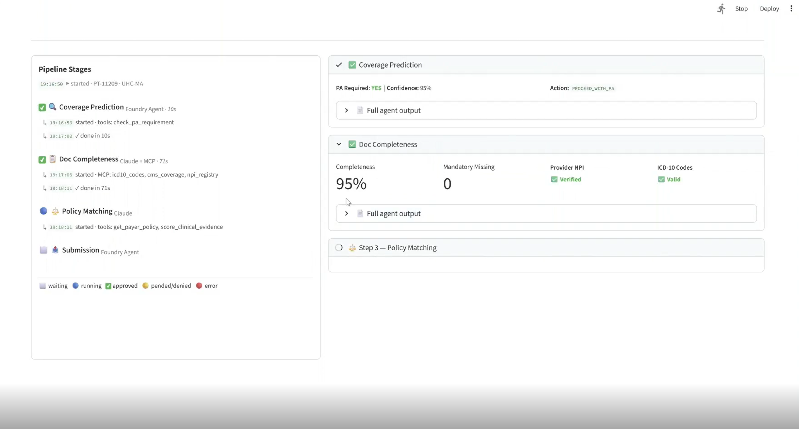
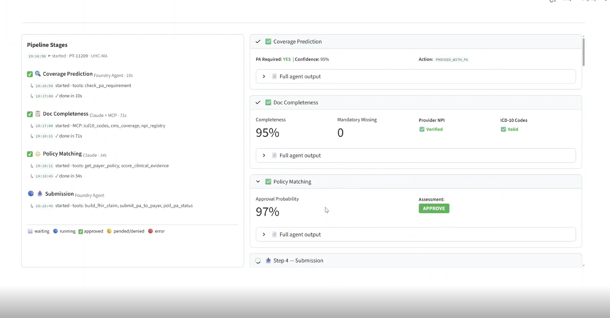

# Prior Authorization Intelligence Platform

The Prior Authorization Intelligence Platform is a multi-agent AI system designed to automate the healthcare prior authorization (PA) workflow — from coverage prediction to appeal strategy.

The system uses specialized AI agents, each responsible for a distinct operational step in the PA lifecycle:

Coverage Prediction Agent – Determines if PA is required for a CPT + ICD-10 + payer combination

Documentation Completeness Agent – Detects missing clinical artifacts against payer criteria

Policy Matching Agent – Scores the case against payer LCD/NCD policy and predicts approval probability

Submission Agent – Builds a FHIR R4 Claim, submits to the payer endpoint, and polls for the decision

Appeal Strategy Agent – Analyzes denial codes, pulls clinical literature via MCP, drafts appeal letters, and recommends peer-to-peer review

---

## Primary Users

| User | How They Use It |
|---|---|
| **Healthcare Providers & RCM Teams** | Authorization specialists pre-check coverage likelihood, detect documentation gaps, and reduce denial rates before submission |
| **Health Insurance Payers** | Utilization management and appeals teams automate medical necessity review, policy validation, and appeal generation to reduce manual workload and improve consistency |
| **HealthTech Platforms** | SaaS and digital health companies embed it to offer AI-driven prior authorization automation as part of their workflow solutions |
| **Enterprise AI & Innovation Teams** | Use it as a blueprint for deploying compliant, multi-agent AI systems in regulated healthcare environments |

---

## Architecture

### Agent Pipeline

| # | Agent | Model | Responsibility |
|---|---|---|---|
| 1 | **Coverage Prediction** | GPT-4o (Microsoft Foundry) | Determines if PA is required for a CPT + ICD-10 + payer combination |
| 2 | **Doc Completeness** | Claude Opus 4.6 (Microsoft Foundry) | Reviews clinical notes against payer criteria; flags missing documentation |
| 3 | **Policy Matching** | Claude Opus 4.6 (Microsoft Foundry) | Scores the case against payer LCD/NCD policy; predicts approval probability |
| 4 | **Submission** | GPT-4o (Microsoft Foundry) | Assembles FHIR Claim (PAS IG), submits to payer endpoint, polls for decision |
| 5 | **Appeal Strategy** | Claude Opus 4.6 (Microsoft Foundry) | Analyzes denial codes, drafts appeal letters, recommends peer-to-peer review |


### Technology Stack

| Component | Technology |
|---|---|
| Agent orchestration | Microsoft Agent Framework (MAF) `1.0.0b260107` |
| GPT-4o agents | `AzureAIAgentClient` — Microsoft Foundry hosted agents |
| Claude agents | `AnthropicClient` — routed via Microsoft Foundry |
| MCP tools | `HostedMCPTool` — globally installed Claude Code plugins |
| Frontend | Streamlit |
| Runtime | Python 3.11+ |

### MCP Healthcare Data Connectors

| MCP Server | Used By | Purpose |
|---|---|---|
| `icd10_codes` | Doc, Policy, Appeal | ICD-10-CM/PCS code validation |
| `cms_coverage` | Doc, Policy, Appeal | Medicare LCD/NCD policy criteria |
| `npi_registry` | Doc, Appeal | Provider NPI verification (NPPES) |
| `pubmed` | Appeal | Clinical literature for medical necessity |

---

## Quick Start

```bash
# 1. Install
pip install -r requirements.txt

# 2. Configure — copy .env.example to .env and fill in:
#    AZURE_AI_PROJECT_ENDPOINT, AZURE_OPENAI_DEPLOYMENT
#    APIM_ENDPOINT, APIM_SUBSCRIPTION_KEY, CLAUDE_MODEL

# 3. Authenticate
az login

# 4. Run
streamlit run frontend.py

# 5. Test
python -m pytest tests/integration/test_pa_pipeline.py -v
```

---

## UI Screenshots

### Case Selector


---

### UC2 — CT-Guided Lung Biopsy · UHC Medicare Advantage · APPROVE

> Coverage Prediction confirms PA required (95% confidence). Doc Completeness scores 95% with 0 mandatory items missing, NPI verified, ICD-10 valid. Policy Matching returns 97% approval probability — APPROVE.

**Coverage Prediction output expanded**


**Doc Completeness — MCP validation in progress**


**Policy Matching — 97% approval, APPROVE**


---

## Implemented Use Cases

| UC | Scenario | Payer | CPT | Workflow | Expected Decision |
|---|---|---|---|---|---|
| UC1 | Total Knee Arthroplasty | BCBS-IL PPO | 27447 | Full 4-stage pipeline | 🟡 PEND — missing BMI + KOOS/KSS |
| UC2 | CT-Guided Lung Biopsy | UHC Medicare Advantage | 32408 | Full 4-stage pipeline | 🟢 APPROVE — complete Fleischner docs |
| UC3 | Biologic / Step Therapy | Cigna PPO | J0129 (HCPCS) | Full 4-stage pipeline | 🟡 PEND — 2nd DMARD trial missing |
| UC5 | Spinal Fusion Denial Appeal | Humana MA | 22612 | Appeal agent only | 🔵 P2P recommendation (CO-50) |
| UC6 | Emergency ED Visit | Aetna HMO | 99285 | Coverage check only | ⚪ PA not required — emergency exempt |
| UC7 | TKA Resubmission after PEND | BCBS-IL PPO | 27447 | Doc + Submission only | 🟢 APPROVE — all gaps resolved |
| UC8 | Colonoscopy, Unknown Payer | Regional HMO | 45378 | Coverage check only | ❓ Unknown — manual verification |

See [usecases.md](usecases.md) for full clinical scenarios and expected agent execution traces for every use case.
See [CLAUDE.md](CLAUDE.md) for AI coding instructions, design principles, and critical implementation patterns.
See [glossary.md](glossary.md) for definitions of clinical, FHIR, and AI terms used throughout.

---

## Project Structure

```
├── app.py                          Streamlit UI, case loader, stage config, prompt builders
├── agents/
│   ├── pa_pipeline.py              _run_one() coroutine — calls agent.run() directly
│   ├── coverage_prediction/        GPT-4o Microsoft Foundry agent
│   ├── doc_completeness/           Claude agent + MCP tools
│   ├── policy_matching/            Claude agent
│   ├── submission/                 GPT-4o Microsoft Foundry agent
│   └── appeal_strategy/            Claude agent + MCP tools
├── shared/
│   ├── build_cases.py              Generates data/cases.json from usecases/ FHIR bundles
│   ├── fhir/validate.py            FHIR R4 resource validation helpers
│   └── tools/
│       ├── anthropic_client.py     AnthropicClient factory (Azure APIM routing)
│       ├── foundry_client.py       AzureAIAgentClient factory (sys.modules stub + agent reuse)
│       ├── mcp_loader.py           MCP server discovery + HostedMCPTool builder
│       ├── fhir_claim.py           build_fhir_claim() — FHIR R4 Claim (Da Vinci PAS IG)
│       ├── payer_api.py            submit_pa_to_payer(), poll_pa_status() (mock + live)
│       ├── pa_rules.py             Payer PA requirement rules
│       ├── criteria.py             Payer documentation criteria
│       └── policy.py               Policy matching scoring
├── usecases/                       FHIR R4 bundles — one per use case (auto-loaded)
│   ├── uc1_tka_bundle.json
│   ├── uc2_lung_biopsy_bundle.json
│   ├── uc3_cath_bundle.json
│   ├── uc4_biologic_bundle.json
│   ├── uc5_spinal_fusion_bundle.json
│   ├── uc6_ed_visit_bundle.json
│   ├── uc7_tka_resubmission_bundle.json
│   └── uc8_colonoscopy_bundle.json
├── data/
│   ├── cases.json                  Auto-generated from usecases/ at startup
│   ├── stages.json                 Stage definitions and MCP/tool assignments
│   ├── payer_pa_rules.json         Payer PA requirement rules
│   ├── payer_criteria.json         Documentation criteria per payer/CPT
│   └── denial_codes.json           Denial code definitions and appeal guidance
├── tests/integration/
│   └── test_pa_pipeline.py         Integration tests (live Azure calls)
├── docs/screenshots/               UI screenshots
├── conftest.py                     pytest asyncio session-scope loop config
├── CLAUDE.md                       AI coding instructions and guardrails
└── .env.example                    Required environment variables
```

